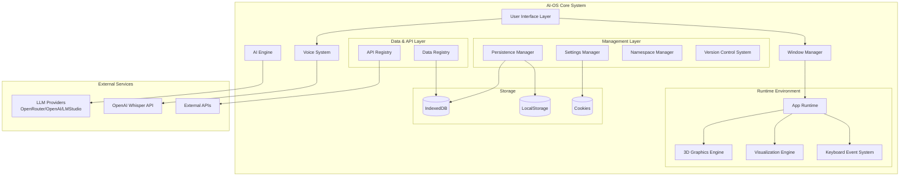
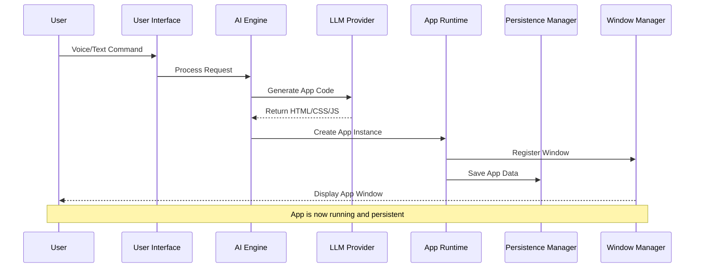
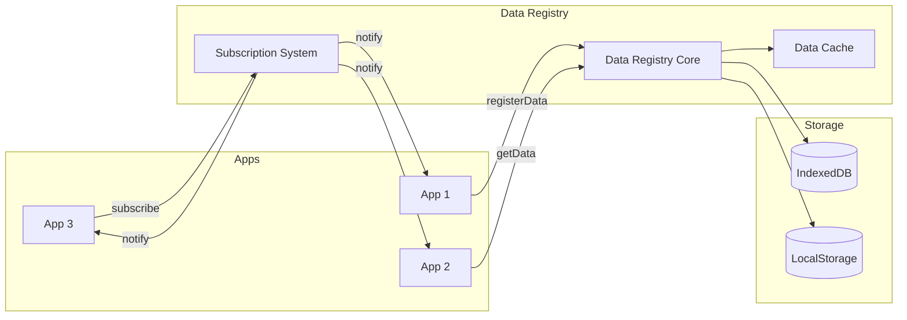
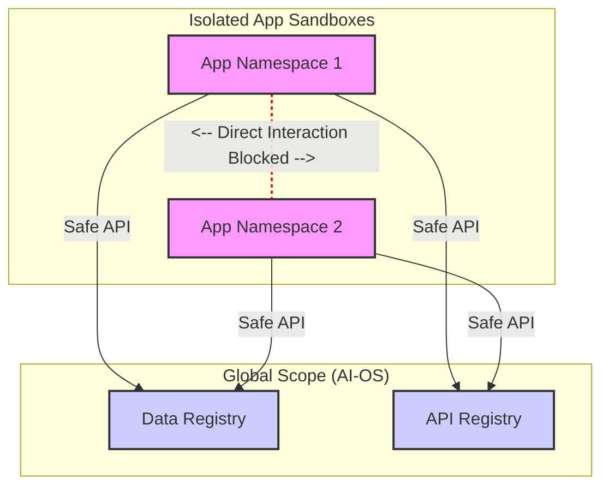

# AI-OS Technical Documentation

This document provides a deep dive into the features, architecture, and technical details of AI-OS.

## 🌟 Features

### User Features

#### Core App Creation & Management
- **AI-Powered App Generation**: Create fully functional applications using natural language descriptions
- **Image-Based App Creation**: Paste screenshots with Ctrl+V when creating apps for visual app generation
- **Real-time App Modification**: Modify existing applications using voice or text commands with context-aware prompts
- **Advanced Version Control**: Complete snapshot management with smart save states and version history
- **App Export/Import**: Save and load applications as JSON files with versioning support
- **Demo Apps**: Pre-built example apps included in `/demo-apps` folder for immediate use

#### Advanced Version Control System
- **Smart Save Management**: Save button only enabled when apps have unsaved changes
- **Snapshot Creation**: Create named snapshots of app states with custom descriptions
- **Version History**: Complete timeline of all app modifications with timestamps
- **Active State Tracking**: Visual indicators show which snapshot is currently active
- **Safe Snapshot Deletion**: Remove unwanted versions with protection for active snapshots
- **Unified Management Interface**: Single dialog for viewing, reverting, and managing all snapshots
- **Non-Blocking Dialogs**: Custom prompts and confirmations that don't freeze the interface
- **Automatic State Detection**: System intelligently tracks when apps are modified or saved

#### App & Data Persistence
- **Persistent App Storage**: Apps automatically saved to IndexedDB when created or modified
- **Session Restoration**: Apps and their data persist across browser sessions
- **Lazy Loading**: Persistent apps only loaded when accessed from Start menu
- **Data Object Persistence**: Shared data objects maintain state between sessions
- **Smart Duplicate Prevention**: System apps don't create duplicate entries in persistence
- **Automatic State Recovery**: Apps restore to their exact last state including data

#### Advanced Voice Control
- **Voice Commands**: Control the system and create apps using voice input (OpenAI Whisper or Web Speech API)
- **Push-to-Talk**: Hold-to-speak functionality for precise voice control (mouse button or touch)
- **Multi-language Support**: 40+ languages supported for Web Speech API
- **Voice Command Popup**: Visual feedback showing recognized voice commands
- **Touch Support**: Mobile-friendly touch events for voice activation

#### Window & Interface Management
- **Dynamic Window Management**: Drag, resize, minimize, maximize, and manage multiple application windows
- **Auto-sizing**: Intelligent window sizing and centering based on content
- **Taskbar Integration**: Quick access to all running applications with hover tooltips
- **Apps Submenu**: Quick access menu in Start menu for all created apps
- **Focus Management**: Visual indicators for active windows with proper focus handling

#### Built-in System Apps
- **Calculator**: Professional calculator with keyboard support and specific color scheme
- **Digital Clock**: Real-time clock with 12/24-hour format toggle and date display
- **Cost Tracking**: Detailed API usage monitoring with history and export functionality
- **Data Registry Browser**: View and manage shared data objects across apps
- **API Registry Manager**: Configure and manage external API endpoints with authentication
- **App Manager**: Comprehensive application management interface
- **Setup Assistant**: First-time setup wizard with progress tracking

#### Enhanced User Interface
- **Non-Blocking Dialog System**: Custom prompts and confirmations that maintain interface responsiveness
- **Professional Popups**: Styled dialogs replace browser defaults with consistent design
- **Smart Save Controls**: Visual feedback for save states with intelligent button management
- **Version Management UI**: Comprehensive interface for snapshot creation, deletion, and restoration
- **Accessible Design**: Screen reader friendly with proper ARIA support and keyboard navigation
- **Theme Integration**: All dialogs automatically adapt to light/dark themes

#### Theme & Customization
- **Theme Support**: Light and Dark mode themes with automatic app theming
- **Smart Icon Generation**: Automatic icon selection based on app content (100+ icon mappings)
- **Consistent Styling**: Unified design language across system and user-generated apps

### Technical Features

#### App Isolation & Security
- **Sandboxed Execution**: Generated apps run in isolated contexts with unique namespaces (`app_${appId}`)
- **Safe App Import**: Automatic app ID reference replacement during import to prevent conflicts
- **Resource Cleanup**: Automatic cleanup of app resources, event handlers, and namespaces on close
- **Input Validation**: All user inputs sanitized and validated for security

#### Shared Data Registry System
- **Global Data Sharing**: Apps can share data through `window.dataRegistry` API
- **Data Subscription**: Real-time notifications when shared data changes
- **Persistent Storage Integration**: Automatic persistence to IndexedDB
- **Session Recovery**: Data objects restored on system startup
- **Data Structure Analysis**: Automatic analysis and documentation of data types and structures
- **Cross-Session Continuity**: Data maintains state between browser sessions

#### API Registry System
- **External API Integration**: Register and manage external API endpoints for app generation
- **Authentication Support**: Multiple authentication types (Bearer tokens, API keys, query parameters)
- **API Testing**: Built-in connection testing with detailed status reporting
- **Smart Authentication**: Automatic Bearer token formatting for OpenAI and similar APIs
- **API Discovery**: LLM automatically discovers and uses registered APIs when generating apps
- **Secure Storage**: API keys stored locally with proper encryption and access control
- **Usage Guidance**: Contextual help and examples for different API authentication methods
- **Status Monitoring**: Real-time API health monitoring with detailed error reporting

#### Advanced AI Integration
- **Multiple LLM Providers**: Support for OpenRouter, OpenAI API, and LMStudio
- **Model Selection**: Choose between "Simple" and "Tough" models for different complexity needs
- **Context-Aware Modification**: Prompt history tracking for intelligent app modifications
- **Image Analysis**: Process pasted images for enhanced app generation
- **Smart Prompting**: Optimized prompts for generating functional web applications
- **Cost Tracking**: Real-time API usage monitoring with detailed cost breakdown

#### 3D Graphics & Visualization Support
- **Three.js Integration**: Pre-loaded Three.js v0.177.0 for 3D graphics, WebGL, and immersive animations
- **Chart.js Integration**: Pre-loaded Chart.js v4.4.1 for data visualization and charts
- **Responsive 3D Rendering**: Automatic window sizing and resize handling for 3D scenes
- **High-Quality Graphics**: Anti-aliasing and high-DPI display support for crisp visuals
- **Dynamic Layout Support**: ResizeObserver integration for adaptive 3D containers

#### Keyboard Event Management
- **Focus-Aware Key Handling**: Keyboard events only sent to active/focused apps
- **App-Specific Shortcuts**: Apps can register custom keyboard handlers using `app.onKey()` API
- **Global Event Distribution**: Centralized keyboard event management system
- **Automatic Cleanup**: Key handlers automatically removed when apps close

#### Performance & Architecture
- **Efficient DOM Manipulation**: Minimal reflows and optimized rendering
- **Smart Caching**: Intelligent caching of app data and settings
- **Single File Architecture**: Lightweight, no external dependencies
- **Responsive Design**: Optimized for desktop and tablet use
- **Error Handling**: Graceful degradation with user-friendly error messages

#### Development & Extensibility
- **Debug Mode**: Comprehensive logging system with `debugLog`, `debugWarn`, `debugError`
- **Settings Persistence**: Cookie-based settings storage with export/import functionality
- **Theme Inheritance**: Automatic theme application to imported and generated apps
- **Namespace Management**: Isolated JavaScript contexts prevent app conflicts

## 🏗️ Architecture

### Core Components
- **Window Manager**: Handles application windows and UI with focus management
- **AI Engine**: Processes natural language and generates applications
- **Version Control System**: Advanced snapshot management with smart save states and history tracking
- **3D Graphics Engine**: Three.js integration for WebGL and 3D rendering
- **Visualization Engine**: Chart.js integration for data visualization
- **Voice System**: Manages speech recognition and audio input with multi-modal support
- **App Runtime**: Executes and manages generated applications with isolation
- **Persistence Manager**: Handles app and data persistence using IndexedDB
- **Settings Manager**: Handles configuration and persistence
- **Data Registry**: Global data sharing system between apps with persistence support
- **API Registry**: External API management system with authentication and testing capabilities
- **Namespace Manager**: Ensures app isolation and prevents conflicts
- **Non-Blocking Dialog System**: Custom prompts and confirmations for responsive user interactions



### Generated App Structure
Each AI-generated app consists of:
- **HTML**: User interface markup
- **CSS**: Styling with theme support
- **JavaScript**: Interactive functionality with isolated namespace
- **Metadata**: Title, description, and configuration
- **Init Function**: Proper initialization with `window[appNamespace].init`



### Theme System
- Apps automatically inherit system theme
- CSS classes: `.app-light-theme` and `.app-dark-theme`
- Consistent color schemes and accessibility
- Dynamic theme application to imported apps

### Data Registry System
- **Global Access**: `window.dataRegistry.getData(name)`
- **Data Registration**: `window.dataRegistry.registerData(name, data, description, structure)`
- **Change Notifications**: `window.dataRegistry.subscribe(name, callback)`
- **Persistent Storage**: Integration with localStorage and sessionStorage



### Keyboard Event System
- **Focus-Aware**: Events only sent to active apps
- **App Registration**: `app.onKey(eventType, handler)`
- **Automatic Cleanup**: Handlers removed when apps close
- **Global Management**: Centralized event distribution

## 🔧 Technical Details

### Supported Technologies
- **Frontend**: Vanilla HTML5, CSS3, JavaScript (ES6+)
- **3D Graphics**: Three.js v0.177.0 (WebGL, 3D scenes, animations)
- **Data Visualization**: Chart.js v4.4.1 (charts, graphs, dashboards)
- **AI Models**: GPT-4, Claude, Gemini, and other LLM providers
- **Voice**: OpenAI Whisper API, Web Speech API
- **Storage**: IndexedDB, LocalStorage, Cookies for persistence
- **Data Sharing**: Custom data registry system with persistence
- **API Integration**: External API registry with authentication and testing

### Browser Compatibility
- ✅ Chrome 80+
- ✅ Firefox 75+
- ✅ Safari 13+
- ✅ Edge 80+

### Performance
- **Lightweight**: Single HTML file, no external dependencies
- **Responsive**: Optimized for desktop and tablet use
- **Efficient**: Minimal resource usage, smart caching
- **Isolated Execution**: Apps run in separate namespaces for stability

### 3D Graphics & Visualization Capabilities

#### Three.js Features
- **WebGL Rendering**: Hardware-accelerated 3D graphics
- **Responsive Viewports**: Automatic sizing and aspect ratio handling
- **High-DPI Support**: Crisp rendering on retina displays
- **Anti-aliasing**: Smooth graphics with reduced jagged edges
- **Dynamic Resizing**: Real-time adaptation to window size changes
- **Performance Optimization**: Efficient rendering loops and resource management

#### Chart.js Features
- **Multiple Chart Types**: Bar, line, pie, doughnut, and more
- **Responsive Design**: Charts adapt to container size changes
- **Interactive Elements**: Hover effects and click handlers
- **Theme Integration**: Automatic adaptation to light/dark themes
- **Data Binding**: Integration with AI-OS data registry system

#### Technical Implementation
- **Pre-loaded Libraries**: No dynamic loading, immediate availability
- **Namespace Isolation**: 3D scenes and charts isolated per app
- **Memory Management**: Proper cleanup when apps are closed
- **Cross-browser Compatibility**: Consistent behavior across modern browsers

### Security Features
- **API Key Protection**: Keys stored locally, never transmitted unnecessarily
- **Sandboxed Execution**: Generated apps run in isolated contexts
- **Input Validation**: All user inputs sanitized and validated
- **Safe Import**: App ID references safely replaced during import

## 📊 Cost Management

### Cost Tracking Features
- **Real-time Monitoring**: Track API costs as you use the system through data registry
- **Detailed History**: View cost breakdown by request type with timestamps
- **Export Data**: Download cost reports for analysis
- **Budget Awareness**: Monitor spending across different AI providers
- **Cost Tracking App**: Built-in system app for comprehensive cost analysis

### Typical Costs (Approximate)
- **Simple App Creation**: $0.001 - $0.01 per app
- **Complex App Creation**: $0.01 - $0.05 per app
- **App Modifications**: $0.005 - $0.02 per modification
- **Voice Recognition**: $0.001 - $0.005 per command

## 🛠️ Development

### Extending the System
The AI-OS is designed to be extensible:

1. **Custom Prompts**: Modify the app generation prompts
2. **New Providers**: Add support for additional LLM providers
3. **System Apps**: Create built-in applications
4. **Themes**: Develop custom theme systems
5. **Data Registry**: Create shared data objects for app communication
6. **API Registry**: Register external APIs for enhanced app capabilities

### App Development Guidelines
- **Use Data Registry**: Access shared data with `window.dataRegistry.getData()`
- **Use API Registry**: Access external APIs with `window.apiRegistry.getAPI()`
- **Implement Init Function**: Use `window[appNamespace].init` for setup
- **Handle Keyboard Events**: Register with `app.onKey()` for keyboard support
- **Theme Support**: Use `.app-light-theme` and `.app-dark-theme` classes
- **Namespace Isolation**: All app code should be namespaced properly

### Code Structure
```
ai-os.html
├── HTML Structure
├── CSS Styling
│   ├── Window Management
│   ├── Theme System
│   ├── Setup Assistant
│   ├── Custom Popup System
│   └── Component Styles
└── JavaScript Logic
    ├── App Management
    ├── AI Integration
    ├── Voice System
    ├── Persistence Manager
    ├── Settings Manager
    ├── Window Manager
    ├── Data Registry
    ├── API Registry
    ├── Custom Popup System
    ├── Keyboard Handler
    └── Cost Tracking
```

## 🔒 Privacy & Security

### Security Model



### Data Handling
- **Local Persistence**: Apps and data stored locally in IndexedDB
- **No Cloud Storage**: All persistence handled locally, no external servers
- **Session Privacy**: Data never leaves your browser
- **API Communication**: Secure HTTPS connections to AI providers
- **No Data Collection**: No personal data collected or transmitted
- **Voice Privacy**: Audio processed by chosen provider only
- **Data Registry**: Shared data stored locally, not transmitted

### Security Features
- **API Key Protection**: Keys stored locally, never transmitted unnecessarily
- **Sandboxed Execution**: Generated apps run in isolated contexts
- **Input Validation**: All user inputs sanitized and validated
- **Safe App Loading**: App ID references safely replaced during import
- **Namespace Isolation**: Apps cannot interfere with each other

## 🐛 Troubleshooting

### Common Issues

#### Voice Recognition Not Working
1. Check microphone permissions in browser
2. Verify OpenAI API key is correct in Settings
3. Ensure you have a stable internet connection

#### App Generation Fails
1. Check your LLM provider API key and settings
2. Simplify your app description
3. Ensure the AI model you've selected is suitable for the task

#### Apps Not Saving
1. Make sure your browser supports IndexedDB
2. Check for any browser errors in the developer console
3. Ensure you have sufficient storage space

#### General Problems
1. Refresh the page
2. Clear browser cache and data for the site
3. Export your settings and apps, reset the system, and re-import