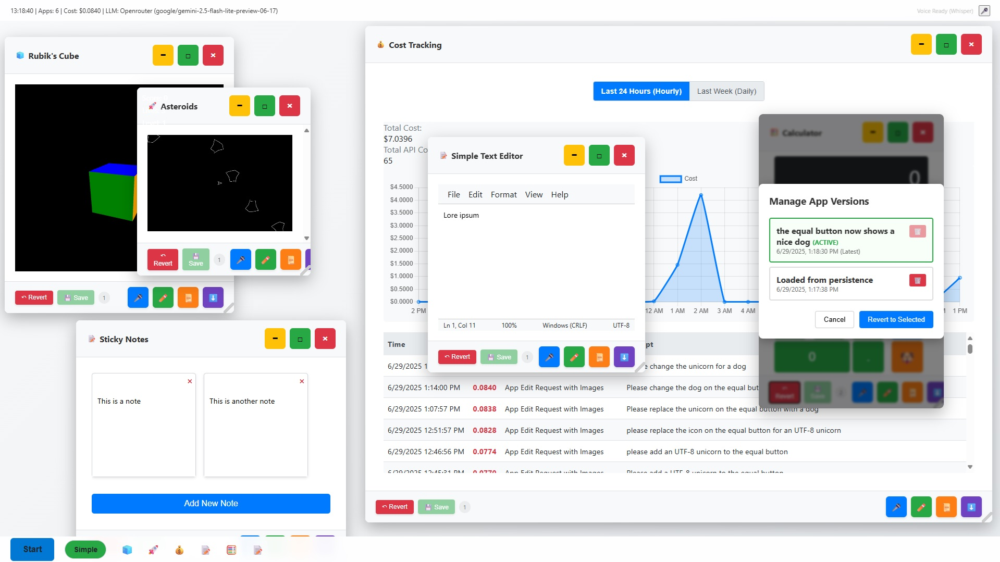

# AI-OS

A revolutionary web-based operating system interface powered by artificial intelligence that can create and modify applications on demand using natural language commands and voice input.



## 🌟 Features

### Core Functionality
- **AI-Powered App Generation**: Create fully functional applications using natural language descriptions
- **Voice Commands**: Control the system and create apps using voice input (OpenAI Whisper or Web Speech API)
- **Dynamic Window Management**: Drag, resize, minimize, maximize, and manage multiple application windows
- **Real-time App Modification**: Modify existing applications using voice or text commands
- **Theme Support**: Light and Dark mode themes with automatic app theming

### AI Integration
- **Multiple LLM Providers**: Support for OpenRouter, OpenAI API, and LMStudio
- **Model Selection**: Choose between "Simple" and "Tough" models for different complexity needs
- **Cost Tracking**: Monitor API usage costs with detailed history
- **Smart Prompting**: Optimized prompts for generating functional web applications

### Voice Recognition
- **OpenAI Whisper**: High-accuracy cloud-based speech recognition
- **Web Speech API**: Browser-based speech recognition (offline capable)
- **Multi-language Support**: 40+ languages supported for Web Speech API
- **Push-to-Talk**: Hold-to-speak functionality for precise voice control

### Application Management
- **App Export/Import**: Save and load applications as JSON files
- **System Apps**: Built-in settings, app manager, and cost tracking applications
- **Auto-sizing**: Intelligent window sizing based on content
- **Taskbar Integration**: Quick access to all running applications

## 🚀 Getting Started

### Prerequisites
- Modern web browser (Chrome, Firefox, Safari, Edge)
- Internet connection for AI features
- Microphone (optional, for voice commands)

### API Keys Required
1. **OpenAI API Key** (for Whisper voice recognition)
   - Sign up at [OpenAI](https://platform.openai.com/)
   - Generate an API key
   - Add to Settings → AI Models → Voice Recognition

2. **LLM Provider API Key** (choose one):
   - **OpenRouter** (recommended): Sign up at [OpenRouter](https://openrouter.ai/)
   - **OpenAI**: Use your existing OpenAI API key (fully compatible as of v2.0.1)
   - **LMStudio**: Run locally, no API key needed

### Recommended Configurations

#### OpenRouter (Recommended)
For the best results, use OpenRouter with these model selections:
- **Simple Mode**: `google/gemini-2.5-flash-lite-preview-06-17` (fast, cost-effective)
- **Tough Mode**: `anthropic/claude-sonnet-4` (high-quality, advanced reasoning)

#### LMStudio Setup
For local LMStudio usage, ensure these settings are enabled in LMStudio server:
- ✅ **Enable CORS** (required for web browser access)
- ✅ **Serve on Local Network** (allows connections from browser)

Recommended models for LMStudio:
- **Simple Mode**: `microsoft/phi-4` (lightweight, fast)
- **Tough Mode**: `deepseek-r1-0528-qwen3-8b` (advanced reasoning)

### Installation
1. Download the [`ai-os.html`](ai-os.html) file
2. Open it in your web browser
3. Configure your API keys in Settings (⚙️)
4. Start creating apps with voice or text commands!

## 🎯 Usage

### Creating Apps
1. **Voice Command**: Click the microphone button and say "Create a calculator app"
2. **Text Input**: Click the Start button and type your app description
3. **Start Menu**: Use the built-in app creation interface

### Voice Commands Examples
- "Create a todo list app"
- "Make a weather dashboard"
- "Build a simple calculator"
- "Create a note-taking application"
- "Make a timer app"

### Modifying Apps
1. Click the microphone button (🎤) in any app window
2. Speak your modification request
3. Or click the text button (✏️) to type modifications

### Window Management
- **Drag**: Click and drag the title bar to move windows
- **Resize**: Drag the resize handle in the bottom-right corner
- **Minimize**: Click the "−" button
- **Maximize**: Click the "□" button
- **Close**: Click the "×" button

## ⚙️ Configuration

### Settings Categories

#### Appearance
- **Theme**: Light/Dark mode selection
- **Automatic theming**: Apps adapt to system theme

#### Voice & Audio
- **Recognition Engine**: Choose between Whisper and Web Speech API
- **Language**: Select from 40+ supported languages
- **Microphone Test**: Built-in audio level testing

#### AI Models
- **Provider Selection**: OpenRouter (recommended), OpenAI, or LMStudio
- **Model Configuration**: Separate simple/tough model settings for optimal performance
- **API Endpoints**: Customizable API URLs
- **Cost Tracking**: Monitor and track API usage costs

**Recommended Model Settings:**
- **OpenRouter Simple**: `google/gemini-2.5-flash-lite-preview-06-17`
- **OpenRouter Tough**: `anthropic/claude-sonnet-4`
- **OpenAI Simple**: `gpt-4o-mini` (cost-effective, fast)
- **OpenAI Tough**: `gpt-4o` (high-quality, advanced reasoning)
- **LMStudio Simple**: `microsoft/phi-4`
- **LMStudio Tough**: `deepseek-r1-0528-qwen3-8b`

#### System
- **Debug Mode**: Enable detailed logging
- **Settings Export/Import**: Backup and restore configurations
- **Cache Management**: Clear cached data

## 🏗️ Architecture

### Core Components
- **Window Manager**: Handles application windows and UI
- **AI Engine**: Processes natural language and generates applications
- **Voice System**: Manages speech recognition and audio input
- **App Runtime**: Executes and manages generated applications
- **Settings Manager**: Handles configuration and persistence

### Generated App Structure
Each AI-generated app consists of:
- **HTML**: User interface markup
- **CSS**: Styling with theme support
- **JavaScript**: Interactive functionality
- **Metadata**: Title, description, and configuration

### Theme System
- Apps automatically inherit system theme
- CSS classes: `.app-light-theme` and `.app-dark-theme`
- Consistent color schemes and accessibility

## 🔧 Technical Details

### Supported Technologies
- **Frontend**: Vanilla HTML5, CSS3, JavaScript (ES6+)
- **AI Models**: GPT-4, Claude, Gemini, and other LLM providers
- **Voice**: OpenAI Whisper API, Web Speech API
- **Storage**: LocalStorage, Cookies for persistence

### Browser Compatibility
- ✅ Chrome 80+
- ✅ Firefox 75+
- ✅ Safari 13+
- ✅ Edge 80+

### Performance
- **Lightweight**: Single HTML file, no external dependencies
- **Responsive**: Optimized for desktop and tablet use
- **Efficient**: Minimal resource usage, smart caching

## 📊 Cost Management

### Cost Tracking Features
- **Real-time Monitoring**: Track API costs as you use the system
- **Detailed History**: View cost breakdown by request type
- **Export Data**: Download cost reports for analysis
- **Budget Awareness**: Monitor spending across different AI providers

### Typical Costs (Approximate)
- **Simple App Creation**: $0.001 - $0.01 per app
- **Complex App Creation**: $0.01 - $0.05 per app
- **App Modifications**: $0.005 - $0.02 per modification
- **Voice Recognition**: $0.001 - $0.005 per command

## 🛠️ Development

### Extending the System
The AI-OS is designed to be extensible:

1. **Custom Prompts**: Modify the app generation prompts
2. **New Providers**: Add support for additional LLM providers
3. **System Apps**: Create built-in applications
4. **Themes**: Develop custom theme systems

### Code Structure
```
ai-os.html
├── HTML Structure
├── CSS Styling
│   ├── Window Management
│   ├── Theme System
│   └── Component Styles
└── JavaScript Logic
    ├── App Management
    ├── AI Integration
    ├── Voice System
    ├── Settings Manager
    └── Window Manager
```

## 🔒 Privacy & Security

### Data Handling
- **Local Storage**: Settings and preferences stored locally
- **API Communication**: Secure HTTPS connections to AI providers
- **No Data Collection**: No personal data collected or transmitted
- **Voice Privacy**: Audio processed by chosen provider only

### Security Features
- **API Key Protection**: Keys stored locally, never transmitted unnecessarily
- **Sandboxed Execution**: Generated apps run in isolated contexts
- **Input Validation**: All user inputs sanitized and validated

## 🐛 Troubleshooting

### Common Issues

#### Voice Recognition Not Working
1. Check microphone permissions in browser
2. Verify API key configuration
3. Test microphone using built-in test tool
4. Try switching between Whisper and Web Speech API

#### App Generation Fails
1. Verify LLM provider API key
2. Check internet connection
3. Review API quota/limits
4. Try switching to different model

#### LMStudio Connection Issues
1. Ensure LMStudio server is running
2. Verify "Enable CORS" is checked in LMStudio server settings
3. Verify "Serve on Local Network" is enabled in LMStudio server settings
4. Check that the correct local URL is configured (usually `http://localhost:1234/v1/chat/completions`)
5. Ensure a model is loaded in LMStudio

#### Performance Issues
1. Close unused applications
2. Clear browser cache
3. Disable debug mode
4. Check available system memory

### Debug Mode
Enable debug mode in Settings → System for detailed logging and troubleshooting information.

## 🔄 Recent Updates (v2.0.1)

### OpenAI API Compatibility Improvements
Recent updates have significantly improved OpenAI API integration:

#### Fixed Issues
- **Model Selection Display**: Resolved issue where OpenAI model names weren't displayed correctly when OpenAI was selected as the LLM provider
- **API Parameter Compatibility**: Updated API requests to use OpenAI-compatible parameters:
  - Changed `max_tokens` to `max_completion_tokens` for OpenAI requests
  - Set temperature to `1` (default) for OpenAI models that don't support custom temperature values
  - Maintained backward compatibility with OpenRouter and LMStudio using original parameters

#### Technical Changes
- Enhanced provider-specific parameter handling in API requests
- Improved settings application logic to correctly update model configurations
- Added conditional parameter setting based on the selected LLM provider

#### Benefits
- **Seamless OpenAI Integration**: OpenAI API now works without parameter errors
- **Better Model Display**: Correct model names (e.g., `gpt-4o-mini`, `gpt-4o`) shown in the interface
- **Improved Reliability**: More stable API communication across all supported providers

## 📈 Roadmap

### Planned Features
- **Mobile Support**: Touch-optimized interface for smartphones
- **Plugin System**: Third-party extensions and integrations
- **Collaboration**: Multi-user app development
- **App Store**: Share and discover community-created apps
- **Advanced AI**: More sophisticated app generation capabilities

### Version History
- **v2.0.1**: Latest version with improved OpenAI API compatibility
  - Fixed model selection display for OpenAI provider
  - Updated API parameters for OpenAI compatibility (`max_completion_tokens`, temperature handling)
  - Enhanced provider-specific parameter handling
- **v2.0.0**: Voice commands and multi-provider support
- **v1.0.0**: Initial release with basic app generation

## 🤝 Contributing

This is an experimental project exploring AI-powered interfaces. Contributions, suggestions, and feedback are welcome!

### Ways to Contribute
- Report bugs and issues
- Suggest new features
- Improve documentation
- Share interesting use cases
- Develop custom themes or extensions

## 📄 License

This project is released under the Apache 2.0 License. See [`LICENSE`](LICENSE) file for details.

## 🙏 Acknowledgments

- **OpenAI**: For GPT models and Whisper API
- **Anthropic**: For Claude models
- **Google**: For Gemini models
- **OpenRouter**: For unified LLM access
- **Web Speech API**: For browser-based voice recognition

## 📞 Support

For questions, issues, or suggestions:
- Open an issue in the repository
- Check the troubleshooting section
- Review the settings configuration guide

---

**AI-OS** - Where artificial intelligence meets operating system design. Create, modify, and manage applications using the power of natural language and voice commands.