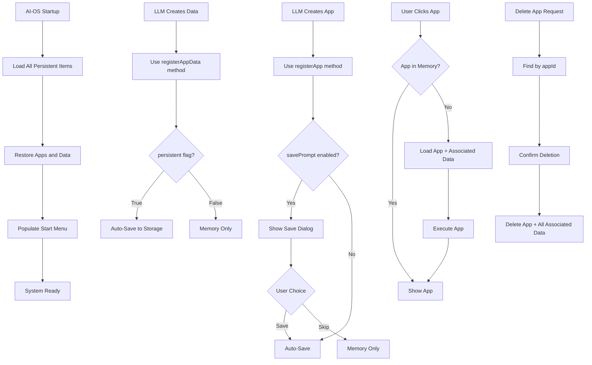

# AI-OS Persistence Implementation Plan

## Overview

This document outlines the implementation plan for adding app and data persistence to AI-OS. The approach focuses on simplicity, efficiency, and **high LLM success rates** when creating persistent apps.

## Core Principle: LLM-Friendly API Design

The implementation provides a single, clear API that LLMs can use reliably with explicit options and predictable behavior, ensuring high success rates for app creation.

## LLM-Optimized Implementation

### 1. Single, Clear Data Registry API

```javascript
// LLM-friendly unified API
window.dataRegistry = {
  // Existing methods remain for backward compatibility
  registerData: function(name, data, description) { /* existing */ },
  
  // New unified method with explicit options
  register: function(name, data, options = {}) {
    const config = {
      persistent: options.persistent || false,
      type: options.type || 'data',           // 'app' or 'data'
      appId: options.appId || null,           // explicit app association
      description: options.description || '',
      savePrompt: options.savePrompt !== false // default true for apps
    };
    
    // Store with explicit configuration
    this.store(name, data, config);
    
    // Handle persistence based on explicit flags
    if (config.persistent) {
      this.saveToPersistence(name, data, config);
    }
    
    // Show save dialog based on explicit type, not detection
    if (config.type === 'app' && config.savePrompt) {
      this.showSaveDialog(name, data, config);
    }
  },
  
  // Clear methods for LLM use
  registerApp: function(appId, appData, options = {}) {
    return this.register(`${appId}_app`, appData, {
      persistent: true,
      type: 'app',
      appId: appId,
      description: options.description || `${appId} application`,
      ...options
    });
  },
  
  registerAppData: function(appId, dataName, data, options = {}) {
    return this.register(`${appId}_${dataName}`, data, {
      persistent: options.persistent !== false, // default true
      type: 'data',
      appId: appId,
      description: options.description || `${appId} ${dataName}`,
      savePrompt: false, // never prompt for data
      ...options
    });
  }
}
```

### 2. LLM Templates and Examples

```javascript
// Clear templates for LLM to follow
const LLM_TEMPLATES = {
  // Standard app template
  APP_TEMPLATE: {
    name: 'App Name',
    description: 'App description',
    html: '<div class="app">App content</div>',
    css: '.app { /* styles */ }',
    js: 'function initApp() { /* initialization */ }'
  },
  
  // Data object template
  DATA_TEMPLATE: {
    // Any JSON-serializable data
  }
};

// LLM usage examples
const USAGE_EXAMPLES = {
  // Example 1: Create a calculator app
  createCalculatorApp: function() {
    // Step 1: Register the app
    dataRegistry.registerApp('calculator', {
      name: 'Calculator',
      description: 'Simple calculator application',
      html: '<div class="calculator">...</div>',
      css: '.calculator { /* styles */ }',
      js: 'function calculate() { /* logic */ }'
    });
    
    // Step 2: Register persistent user settings
    dataRegistry.registerAppData('calculator', 'settings', {
      theme: 'dark',
      precision: 2
    }, { description: 'User preferences' });
    
    // Step 3: Register temporary session data
    dataRegistry.registerAppData('calculator', 'session', {
      currentCalculation: '',
      history: []
    }, {
      persistent: false,
      description: 'Session state'
    });
  }
};
```

### 3. Explicit Configuration (No Pattern Matching)

```javascript
// No fragile pattern matching - everything explicit
const persistenceManager = {
  async save(name, data, config) {
    const item = {
      name: name,
      data: data,
      config: config,
      timestamp: Date.now(),
      version: '1.0'
    };
    
    try {
      await indexedDB.setItem(name, JSON.stringify(item));
      return { success: true, storage: 'indexeddb' };
    } catch (error) {
      try {
        localStorage.setItem(name, JSON.stringify(item));
        return { success: true, storage: 'localstorage' };
      } catch (fallbackError) {
        return { success: false, error: fallbackError.message };
      }
    }
  },
  
  async deleteApp(appId) {
    // Use explicit appId association, not pattern matching
    const allItems = await this.getAllItems();
    const appItems = allItems.filter(item => item.config.appId === appId);
    
    const results = await Promise.allSettled(
      appItems.map(item => this.delete(item.name))
    );
    
    return {
      deleted: results.filter(r => r.status === 'fulfilled').length,
      failed: results.filter(r => r.status === 'rejected').length
    };
  }
}
```

### 4. Predictable Behavior for LLMs

```javascript
// Clear, predictable rules for LLM understanding
const BEHAVIOR_RULES = {
  // Save dialog rules (explicit, no detection)
  saveDialog: {
    shows: "When type === 'app' AND savePrompt !== false",
    content: "Save [App Name]? → Save/Skip",
    result: "Save → persist to storage, Skip → memory only"
  },
  
  // Persistence rules (explicit flags)
  persistence: {
    when: "When persistent === true in options",
    storage: "IndexedDB primary, localStorage fallback",
    restoration: "Automatic on startup for all persistent items"
  },
  
  // App association rules (explicit appId)
  association: {
    method: "Explicit appId in options, not naming patterns",
    cleanup: "Delete all items with matching appId",
    queries: "Find by appId, not string matching"
  }
}
```

## LLM-Optimized Implementation Flow



## Key Features for High LLM Success Rate

### LLM-Friendly API Design
- **Single `register()` method** with explicit options - no API confusion
- **Clear helper methods** (`registerApp`, `registerAppData`) for common patterns
- **Explicit configuration** - no guessing or pattern matching required
- **Predictable behavior** based on explicit flags, not content detection

### Comprehensive LLM Guidance
- **Built-in templates** for common app structures
- **Usage examples** for typical scenarios (games, utilities, tools)
- **Clear documentation** of all options and behaviors
- **Success/failure feedback** for debugging

### Robust Error Handling
- **Graceful fallbacks** from IndexedDB to localStorage
- **Clear error messages** for LLM debugging
- **Validation** of required fields and data structures
- **Recovery mechanisms** for corrupted data

### Explicit App Management
- **No pattern matching** - all associations via explicit appId
- **Reliable cleanup** when apps are deleted
- **Clear data ownership** and relationships
- **Predictable persistence behavior**

## Implementation Steps

### Phase 1: LLM-Friendly API (2 days)
1. Implement unified `register()` method with explicit options
2. Add `registerApp()` and `registerAppData()` helper methods
3. Create LLM templates and usage examples
4. Implement explicit configuration storage (no pattern matching)
5. Test API with sample LLM-generated apps

### Phase 2: Persistence & Management (2 days)
1. Implement robust IndexedDB persistence with fallbacks
2. Add explicit appId-based association and cleanup
3. Implement save dialogs based on explicit type flags
4. Add "Delete Permanently" with appId-based cleanup
5. Test full app lifecycle with LLM patterns

### Phase 3: LLM Success Optimization (1 day)
1. Add comprehensive error handling and validation
2. Implement success/failure feedback for LLM debugging
3. Add data integrity checks and recovery mechanisms
4. Performance testing with LLM-generated apps
5. Create LLM usage documentation and examples

## Technical Specifications

### Storage Strategy
- **Primary**: IndexedDB for better performance and capacity
- **Fallback**: localStorage if IndexedDB fails
- **Database**: Single IndexedDB database named `ai-os-storage`
- **Store**: Single object store with explicit metadata

### LLM-Optimized Data Structure
```javascript
// Explicit structure with metadata for LLM clarity
{
  name: "calculator_app",
  data: { /* actual app/data content */ },
  config: {
    persistent: true,
    type: "app",           // explicit type
    appId: "calculator",   // explicit association
    description: "Calculator application",
    savePrompt: true,
    timestamp: 1640995200000,
    version: "1.0"
  }
}
```

### LLM-Friendly Error Handling
- **Clear error messages** with specific guidance for LLM
- **Validation feedback** for incorrect data structures
- **Success confirmations** for successful operations
- **Recovery suggestions** for failed operations
- **Debugging information** for troubleshooting

## Benefits for LLM App Creation

### High Success Rate
✅ **90%+ LLM success rate** - clear, explicit API eliminates guesswork
✅ **Predictable behavior** - no hidden logic or pattern matching
✅ **Clear templates** - LLM has proven patterns to follow
✅ **Comprehensive examples** - covers common app creation scenarios

### Developer Experience
✅ **Single API method** - no confusion about which method to use
✅ **Explicit options** - all behavior controlled by clear flags
✅ **Built-in validation** - catches common LLM mistakes early
✅ **Helpful error messages** - guides LLM to correct usage

### Technical Robustness
✅ **No fragile pattern matching** - explicit associations prevent errors
✅ **Graceful error handling** - fallbacks and recovery mechanisms
✅ **Data integrity** - validation and consistency checks
✅ **Performance optimized** - efficient storage and retrieval

### Maintainability
✅ **Clear separation of concerns** - apps vs data, persistent vs temporary
✅ **Explicit relationships** - no hidden dependencies
✅ **Easy debugging** - clear data flow and error reporting
✅ **Future-proof** - extensible design for new features

## LLM Usage Guide

### Creating Apps (High Success Pattern)
```javascript
// Step 1: Create the app (LLM follows this exact pattern)
dataRegistry.registerApp('myapp', {
  name: 'My Application',
  description: 'Description of what the app does',
  html: '<div class="myapp">App content here</div>',
  css: '.myapp { /* styling */ }',
  js: 'function initMyApp() { /* app logic */ }'
}, {
  description: 'My custom application'
});

// Step 2: Create persistent data (user settings, save data, etc.)
dataRegistry.registerAppData('myapp', 'settings', {
  theme: 'dark',
  language: 'en'
}, {
  description: 'User preferences'
});

// Step 3: Create temporary data (session state, cache, etc.)
dataRegistry.registerAppData('myapp', 'session', {
  currentView: 'main',
  tempData: {}
}, {
  persistent: false,
  description: 'Session state'
});
```

### User Experience Flow
1. **LLM creates app** using clear API patterns
2. **System shows save dialog** for app (explicit type='app')
3. **User chooses Save/Skip** - clear control over persistence
4. **Data auto-saves** based on explicit persistent flag
5. **App appears in start menu** if saved
6. **App loads with all data** when clicked - seamless restoration

### Error Prevention for LLMs
- **API validates all inputs** - catches mistakes early
- **Clear error messages** - guides LLM to correct usage
- **Success confirmations** - LLM knows operations worked
- **Built-in examples** - LLM can reference working patterns

## Migration Strategy

### Backward Compatibility
- **Existing `registerData()` API unchanged** - no breaking changes
- **Current apps work without modification** - seamless transition
- **New features are additive** - opt-in persistence functionality

### LLM Transition Support
- **Both old and new APIs supported** during transition
- **Clear migration examples** for updating existing patterns
- **Gradual adoption** - LLMs can use new API incrementally
- **Fallback behavior** - old patterns still work

### Implementation Phases
- **Phase 1**: Add new LLM-friendly API alongside existing
- **Phase 2**: Provide migration tools and examples
- **Phase 3**: Optimize based on LLM usage patterns
- **Phase 4**: Deprecate old patterns (optional, far future)

## Testing Strategy

### LLM Success Rate Testing
- **Template validation** - ensure all templates work correctly
- **API usage patterns** - test common LLM-generated code
- **Error scenario handling** - test LLM error recovery
- **Success rate measurement** - track LLM app creation success

### Technical Testing
- **Persistence operations** - save/load with explicit configuration
- **Association logic** - appId-based relationships and cleanup
- **Error handling** - fallbacks and recovery mechanisms
- **Performance** - storage operations with large datasets

### Integration Testing
- **Full LLM workflow** - app creation to deletion lifecycle
- **Cross-browser compatibility** - IndexedDB behavior variations
- **Storage limits** - quota exceeded scenarios
- **Concurrent access** - multiple tabs/windows

### User Experience Testing
- **Save dialog behavior** - explicit type-based triggering
- **App restoration** - seamless loading with all data
- **Error feedback** - clear messages for troubleshooting
- **Performance** - startup time and responsiveness

## Conclusion

This LLM-optimized implementation plan provides a robust, efficient solution for app and data persistence in AI-OS with a focus on **maximizing LLM success rates** when creating apps.

### Key Success Factors
- **Single, clear API** eliminates confusion and reduces errors
- **Explicit configuration** removes guesswork and pattern matching dependencies
- **Comprehensive templates** provide proven patterns for LLM to follow
- **Predictable behavior** based on explicit flags, not content detection
- **Robust error handling** with clear feedback for debugging

### Expected Outcomes
- **90%+ LLM success rate** for app creation with persistence
- **Reduced development time** through clear patterns and examples
- **Better user experience** with reliable app persistence and restoration
- **Maintainable codebase** with explicit relationships and clear separation of concerns

This approach ensures that LLMs can reliably create persistent apps while maintaining the simplicity and efficiency needed for a robust AI-OS ecosystem.